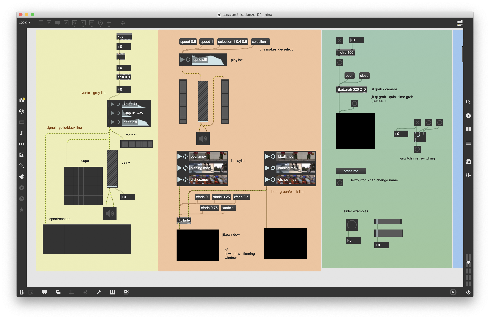
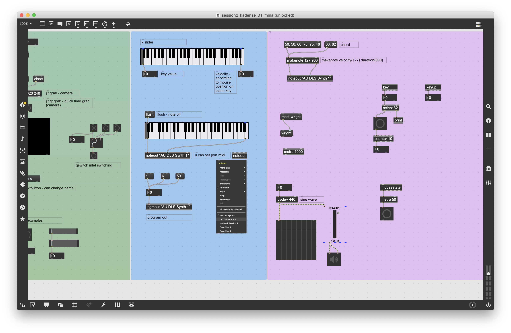

# S-CCC-FMI-2019
### Self Creative Coding Club, FMI MADtech, 2019 

This is Self Creative Coding Club(S-CCC) organized by students in MADtech(Master in Media, Art, Design and Technology), Frank Mohr Institute(FMI). 
We study and code MasMSP together, to get used to it and to play better with it. 
  
Come and Join *every Monday 7PM @ FMI basement*
 

#### How to
> Select one topic each time  Lean via online tutorial and code together  Giving feedback each other  Posting learning outcomes on github 

#### Learning sources

* [Kadenze (Programming Max: Structuring Interactive Software for Digital Arts)](https://www.kadenze.com/courses/programming-max-structuring-interactive-software-for-digital-arts-i/info)
* [Youtube (Programming for People, maxmsp 7)](https://www.youtube.com/playlist?list=PLmEFHC9k1VTZW-VORirBGcICKpC82WIFD)

#### topics
* Data processing (data receiving, parsing, translating into sound, visual etc)
* [Node.js with max](https://cycling74.com/articles/node-for-max-intro-%E2%80%93-let%E2%80%99s-get-started?utm_source=Max+Friends+List&utm_campaign=dabe88be3c-EMAIL_CAMPAIGN_2019_01_08_05_38&utm_medium=email&utm_term=0_6c6d94f223-dabe88be3c-67133533&mc_cid=dabe88be3c&mc_eid=2f6faf24f5)
* [Processing osc, interaction with other softwares(p5.js, arduino, processing etc)](https://medium.com/@contra/transmitting-osc-data-via-websocket-43fcc8bfade7?fbclid=IwAR2Jkes8kO9zNNZml_6RlxsUVmbCVLGpie_u3rNoVPZyy9DrVtsjVQjVa3k)
* interaction a/v with movement or other (human?)senses

 

 

## 18.02.2019 First MaxMSP Study 

### Kadenze "Programming Max: Structuring Interactive Software for Digital Arts"
[Session 2 - Fundamental Elements](https://www.kadenze.com/courses/programming-max-structuring-interactive-software-for-digital-arts-i/sessions/fundamental-elements) 

#### Praticipants
* Mina
* Snow
* Nancy

</img>
</img>

